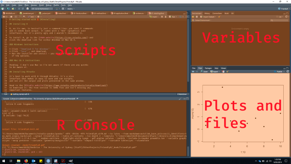

# Getting started with R {#installing}

## Installing R

R, on its own, is basically just a command-line: you send it commands
and it sends back output. It comes with a "GUI" (graphical user
interface), but it's pretty ugly and I wouldn't recommend it.

To install R, go to the [CRAN website](https://cran.rstudio.com/) and
click the download link for either Windows or Mac OS X.

### Windows instructions

* Click `"Download R for Windows"`
* Click `"base"`, and download.
* Run the installer and install - you shouldn't need to change any
  of the options.
  
### Mac OS X instructions

Pending. I don't use Mac so I'm not aware if there are any quirks
to be aware of.

## Installing RStudio

It's best to work with R through RStudio: it's a nice
interface that makes it easy to save and run scripts,
and see all the output and plots presented in the same window.

Head to the [RStudio website](https://www.rstudio.com/products/rstudio/download/) 
to download it: the free version is 100% fine and isn't missing any
important features.

## Running RStudio

Open up RStudio and you should see the standard 4-pane layout:



This may look like information overload at first, but most of the time, you'll
just be looking at the **"Scripts"** section where you've written your code.

```{block, type='note'}
**Optional:** Go to **Tools -> Global options -> Appearance** and switch 
to a dark theme - it's easier on the eyes and it looks cool.
```

You should now be able to run your first R command
by clicking in the console and typing `1 + 1` and hitting
\<Enter\>:

```{r first_command}
1 + 1
```

Or for something a bit more interesting, copy and paste these lines
into the console and hit \<Enter\>:

```{r first_plot, fig.width=4, fig.height=4}
plot(iris$Petal.Length, iris$Petal.Width, 
     xlab = "Length", ylab = "Width", 
     main = "Petals of different flower species",
     col = c("green", "purple", "orange")[iris$Species],
     pch = 16)
```

```{block, type='note'}
Don't worry if this code looks a bit complicated: some of the default plots
in R are ugly, and they need tweaking to look halfway presentable. We'll
see better ways to produce nice plots later.
```

## Installing your first packages

A lot of the most useful tools in R come from third-party packages. Thankfully
they're easy to install, through the `install.packages()` command. Try
installing the `ggplot2` package (an excellent plotting package) to make 
sure everything is working:

```{r install_ggplot2, eval=FALSE}
install.packages("ggplot2")
```

The install process should be automatic, and it will also install
other packages that `ggplot2` needs. Just in case, you should check
the last few lines of the output that `install.packages()` produces,
and look for messages like:

```
package ‘ggplot2’ successfully unpacked and MD5 sums checked
```

### The `tidyverse`

This is Hadley.

{height=200px}

Hadley is your friend. As well as creating `ggplot2`, Hadley is the mastermind
behind the `tidyverse`, a set of R packages designed to make processing
and analysing your data easier, and to smooth out some of R's quirks. 
We'll be using the `tidyverse` packages throughout this tutorial, so let's 
install them now: 

```{r install_tidyverse, eval=FALSE}
install.packages("tidyverse")
```

This will install multiple packages, but again the process should be
automatic.

### The `tidyverse` in action

Now that we have some basic packages set up, let's see what they can
do for us:

```{r iris_nicer}
# Load the ggplot2 library into our R session
library(ggplot2)

ggplot(iris, aes(x = Petal.Length, y = Petal.Width, colour = Species)) +
    geom_point(size = 3) +
    scale_colour_viridis_d() +
    labs(title = "A nicer looking plot",
         x = "Petal length", y = "Petal width") +
    theme_bw()
```

### Installing other packages

As you try out different analyses and tasks in R, you'll
come across recommendations for other packages - there are
no major drawbacks to trying them out, so feel free to install and have
a look. It's worth trying to keep the number of packages
in a single analysis low to avoid overlap and some occasional conflicts
between packages, so check if there any you're loading that aren't need anymore.

