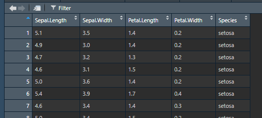

# Tips for effective R programming

```{r tips_setup, echo=FALSE, message=FALSE}
library(tidyverse)
```

Before getting into actual R code, we'll start with a few notes
about how to use it most effectively. Bad coding habits can
make your R code difficult to read and understand, so hopefully
these tips will ensure you have good habits right from the start.

## Working directories

Wherever your working directory is, your files will save to. If you want to call in files from/save files to a different folder, you will need to specify an alternative filepath. For this reason, you should set your working directory to a convenient location at the start of each session.

```{r, eval=FALSE}
getwd() #to see where your current working directory is
setwd() #to set your working directory
```
For ease, we will use Rstudio's point-and-click capabilities to set your working directory. In the bottom right pane, click the three dots in the top right of the pane, and navigate to the folder you would like to set as your directory. Then click 'More' (next to the gear icon), and select 'Set as working directory'.

Having all your files in one folder and setting this as your working directory will mean the difference between having to write:

```{r abs_path, eval=FALSE}
data = haven::read_spss("R:/Project/2013/Analyses/Regressions/Data/Raw.sav")
```

And:

```{r rel_path_example, eval=FALSE}
data = haven::read_spss("Data/Raw.sav")
```


## Using scripts

So far we have been typing in the console. BUT NO-ONE DOES THIS IN REAL LIFE.

It's best to put every step of your data cleaning and analysis
in a script that you save, rather than making temporary changes
in the console.

Ideally, this will mean that you (or anyone else) can run the script
from top to bottom, and get the same results every time, i.e. they're
**reproducible**. 

### Script layout

Most R scripts I write have the same basic layout:

1. Loading the libraries I'm using
2. Loading the data
3. Changing or analysing the data
4. Saving the results or the recoded data file

For a larger project, it's good to create multiple different scripts for
each stage, e.g. one file to recode the data, one to run the analyses.

When saving the recoded data, it's best to save it as a different file -
you keep the raw data, and you can recreate the recoded data
exactly by rerunning your script.

```{block, type='note'}
R won't overwrite your data files when you change your data,
unless you specifically ask it to. When you load a file into
R, it lives in R's 'short-term memory', and doesn't 
maintain any connection to the file on disk. It's only when
you explicitly save to a file that those changes become
permanent.
```

##Saving your scripts

Save your script (to your current working directory) by clicking the save icon, or File>Save. You will be prompted to give your script a name the first time you do this. Once saved, you will see the script appear in the bottom right pane displaying all of the files within your working directory.


## Writing readable code

There are two very good reasons to try to write your code in
a clear, understandable way:

* Other people might need to use your code.
* You might need to use your code, a few weeks/months/years
  after you've written it.
  
It's possible to write R code that "works" perfectly, and
produces all the results and output you want, but proves
very difficult to make changes to when you have to come back
to it (because a reviewer asked for one additional analysis, etc.)
  
### Basic formatting tips

You can improve the readability of your code a lot by following
a few simple rules:

* Put spaces between and around variable names and operators (`=+-*/`)
* Break up long lines of code
* Use meaningful variable names composed of 2 or 3 words (avoid abbreviations
  unless they're very common and you use them very consistently)
  
These rules can mean the difference between this:

```{r badly_formatted_code, eval=FALSE}
lm1=lm(y~grp+grpTime,mydf,subset=sext1=="m")
```

and this:

```{r well_formatted_code, eval=FALSE}
male_difference = lm(DepressionScore ~ Group + GroupTimeInteraction,
                     data = interview_data,
                     subset = BaselineSex == "Male")
```

R will treat both pieces of code exactly the same, but for any humans reading,
the nicer layout and meaningful names make it much easier to understand
what's happening, and spot any errors in syntax or intent.

### Keeping a consistent style

Try to follow a consistent style for naming things, e.g. using `snake_case` 
for all your variable names in your R code, and `TitleCase` for the 
columns in your data. Either style is probably better than lowercase with
no spacing `allmashedtogether`.

### Writing comments

One of the best things you can do to make R code readable and
understandable is write comments - R ignores lines that start with
`#` so you can write whatever you want and it won't affect
the way your code runs.

Comments that explain *why* something was done are great:

```{r why_comment_example, eval=FALSE}
# Need to reverse code the score for question 3
data$DepressionQ3 = 4 - data$DepressionQ3
```


## Don't panic: dealing with SPSS withdrawal

### RStudio has a data viewer

As you get used to R, you should find that you get more comfortable
using the console to check on your data. You can often see
a lot of the information you need by printing the first few
rows of a dataset to the console. The `head()` function prints
the first 6 rows of a table by default, and you can select the columns that
are most relevant to what you're working on if there are too many:

```{r console_view_example, eval=FALSE}
head(iris[, c("Species", "Petal.Length")])
```

```{r console_view_output, echo=FALSE}
print.data.frame(head(iris[, c("Species", "Petal.Length")]))
```

However, you can also use RStudio's built-in data viewer to get a more
familiar, spreadsheet style view of your data. In the **Environment**
pane in the top-right, you can click on the name of any data you
have loaded to bring up a spreadsheet view:



This also supports basic sorting and filtering so you can explore
the data more easily (you'll still need to write code using functions
like `arrange()` or `filter()` if you want to actually make
changes to the data though).

### R can read SPSS files (and csvs, and almost every kind of file!)

The `haven` package can read (and write) SPSS data files, so you
can read in existing data.
Place the SPSS file we sent to you in your working directory. Then run:

```{r read_spss_example, eval=FALSE}
survey_one = haven::read_spss("Personality.sav")
```

If we click on this data in our environment in the top right pane, we can see it in the data viewer.

