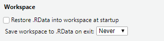

# Tips for effective R programming

```{r tips_setup, echo=FALSE, message=FALSE}
library(tidyverse)
```

Before getting into actual R code, we'll start with a few notes
about how to use it most effectively. Bad coding habits can
make your R code difficult to read and understand, so hopefully
these tips will ensure you have good habits right from the start.

## Use RStudio's "projects" feature

Every project you do in R should be set up in its own folder, through
RStudio's "projects" feature. To start a fresh project, go to
**File -> New project** and create a new folder. Reopen the project
in RStudio whenever you want to work with it.

When sending your work to other people, you can send them the whole
folder and know that they'll have access to all the required files and
scripts.

One of the main benefits is that this sets R's "working directory" to
the project folder by default. Any files you load or save can
just be referenced relative to that folder, so instead of:

```{r abs_path, eval=FALSE}
data = haven::read_spss("R:/Project/2013/Analyses/Regressions/Data/Raw.sav")
```

You can just do:

```{r rel_path_example, eval=FALSE}
data = haven::read_spss("Data/Raw.sav")
```

This will also work for anyone you send the project to, so you don't
have to worry that the file is in a different location on their machine.

## Using scripts

It's best to put every step of your data cleaning and analysis
in a script that you save, rather than making temporary changes
in the console.

Ideally, this will mean that you (or anyone else) can run the script
from top to bottom, and get the same results every time, i.e. they're
**reproducible**.

### Script layout

Most R scripts I write have the same basic layout:

1. Loading the libraries I'm using
2. Loading the data
3. Changing or analysing the data
4. Saving the results or the recoded data file

For any larger project, it's good to create multiple different scripts for
each stage, e.g. one file to recode the data, one to run the analyses.

When saving the recoded data, it's best to save it as a different file -
you keep the raw data, and you can recreate the recoded data
exactly by rerunning your script.

```{block, type='note'}
R won't overwrite your data files when you change your data,
unless you specifically ask it to. When you load a file into
R, it lives in R's 'short-term memory', and doesn't 
maintain any connection to the file on disk. It's only when
you explicitly save to a file that those changes become
permanent.
```

### A tip for better reproducibility

By default, RStudio will save your current "workspace" when you
quit. While convenient, this can mean that you make one-off changes
to your data and forget to save that command in your script, instead
continuing to work off the data in your workspace. Starting
with a fresh session every time you open RStudio means you'll learn
to keep every step of your analysis in your script, and you'll
know that you can get back to where you were by rerunning the script.

To disable the default setting, go to **Tools -> Global options..**,
and in the **General** tab,  and:

* Uncheck "Restore .RData"
* Set "Save workspace on exit" to "Never"



## Long or wide data

R works better with **long** data, whereas SPSS generally works
better with **wide** data. Roughly speaking, **long** data means:

* There is one "observation" of each participant/subject per row - e.g. one 
  survey, one session
* All the measurements of the same type are in one column - so all the
  K6 scores, from multiple surveys, would be in a single `K6` column,
  with an additional `Time` or `Survey` column that identifies which
  survey they come from.
  
Example long data:

```{r long_example, echo=FALSE}
long = data.frame(
    ID = c(1, 1, 2, 2),
    Survey = c(1, 2, 1, 2),
    Drinking = c("No", "Yes", "No", "No"),
    AnxietyTotal = c(6, 8, 5, 7),
    stringsAsFactors = FALSE
)
long %>% knitr::kable()
```

Example wide data:

```{r wide_example, echo=FALSE}
library(tidyr)

wide = long %>%
    pivot_wider(
        names_from = "Survey",
        names_prefix = "T",
        values_from = c("Drinking", "AnxietyTotal")
    )
wide %>% knitr::kable()
```

### Going from wide to long {#wide-to-long}

If your data is currently in wide format, you may have to **reshape**
it before working with it in R. The new `pivot_longer` and `pivot_wider`
functions from the `tidyr` package are good for [reshaping data like this](https://tidyr.tidyverse.org/dev/articles/pivot.html).
To go from the wide data above to a long dataset:

```{r pivot_example, eval=FALSE}
wide %>%
    tidyr::pivot_longer(
        cols = Drinking_T1:AnxietyTotal_T2,
        names_to = c(".value", "Time"),
        names_sep = "_"
    )
```

This can get more complicated if the columns haven't been
named consistently, or have multiple pieces of info 
stored in the name (e.g. `t1_male_mean`)

```{block, type='note'}
At the time of writing, the `pivot` functions were still in
beta, but should be in the new `tidyr` version shortly.
```

## Writing readable code

There are two very good reasons to try to write your code in
a clear, understandable way:

* Other people might need to use your code.
* You might need to use your code, a few weeks/months/years
  after you've written it.
  
It's possible to write R code that "works" perfectly, and
produces all the results and output you want, but proves
very difficult to make changes to when you have to come back
to it (because a reviewer asked for one additional analysis, etc.)
  
### Basic formatting tips

You can improve the readability of your code a lot by following
a few simple rules:

* Put spaces between and around variable names and operators (`=+-*/`)
* Break up long lines of code
* Use meaningful variable names composed of 2 or 3 words (avoid abbreviations
  unless they're very common and you use them very consistently)
  
These rules can mean the difference between this:

```{r badly_formatted_code, eval=FALSE}
lm1=lm(y~grp+grpTime,mydf,subset=sext1=="m")
```

and this:

```{r well_formatted_code, eval=FALSE}
male_difference = lm(DepressionScore ~ Group + GroupTimeInteraction,
                     data = interview_data,
                     subset = BaselineSex == "Male")
```

R will treat both pieces of code exactly the same, but for any humans reading,
the nicer layout and meaningful names make it much easier to understand
what's happening, and spot any errors in syntax or intent.

### Keeping a consistent style

Try to follow a consistent style for naming things, e.g. using `snake_case` 
for all your variable names in your R code, and `TitleCase` for the 
columns in your data. Either style is probably better than lowercase with
no spacing `allmashedtogether`.

It doesn't particularly matter what that style is, as long as you're
consistent. There is a [suggested style guide for the tidyverse](https://style.tidyverse.org/),
but I don't follow it 100%, I just try to be consistent within my code.

### Writing comments

One of the best things you can do to make R code readable and
understandable is write comments - R ignores lines that start with
`#` so you can write whatever you want and it won't affect
the way your code runs.

Comments that explain *why* something was done are great:

```{r why_comment_example, eval=FALSE}
# Need to reverse code the score for question 3
data$DepressionQ3 = 4 - data$DepressionQ3
```

Comments that explain *what* is being done are less useful. People
who already understand R code should be able to tell what is
happening just by looking at your code (especially if you're following
the other advice about writing readable code), so these comments
can be redundant:

```{r what_comment_example, eval=FALSE}
# Calculate the mean of the anxiety scores
anxiety_mean = mean(data$AnxietyTotal)
```

The exception to this is when you've run into something that
was tricky to get working, and you need to explain it so other
people don't run into the same issue: 

```{r what_tricky_example, eval=FALSE}
# (Example only, do not run)
# This fails to converge if we don't set the fix_missing option
drinking_model = logit_regression(Drink ~ Group, fix_missing=TRUE)
```


## Don't panic: dealing with SPSS withdrawal

### RStudio has a data viewer

As you get used to R, you should find that you get more comfortable
using the console to check on your data. You can often see
a lot of the information you need by printing the first few
rows of a dataset to the console. The `head()` function prints
the first 6 rows of a table by default, and you can select the columns that
are most relevant to what you're working on if there are too many:

```{r console_view_example, eval=FALSE}
head(iris[, c("Species", "Petal.Length")])
```

```{r console_view_output, echo=FALSE}
print.data.frame(head(iris[, c("Species", "Petal.Length")]))
```

However, you can also use RStudio's built-in data viewer to get a more
familiar, spreadsheet style view of your data. In the **Environment**
pane in the top-right, you can click on the name of any data you
have loaded to bring up a spreadsheet view:


This also supports basic sorting and filtering so you can explore
the data more easily (you'll still need to write code using functions
like `arrange()` or `filter()` if you want to actually make
changes to the data though).

### R can read SPSS files

The `haven` package can read (and write) SPSS data files, so you
can read in existing data:

```{r read_spss_example, eval=FALSE}
survey_one = haven::read_spss("Data/Survey1_Final.sav")
```

R doesn't deal with "value labels" in the same way as SPSS, and
`haven` tries to keep information about the SPSS value labels available. 
However, it's best to just convert everything to R's way of dealing with 
categorical variables, i.e. factors, using `haven`'s `as_factor()` function:

```{r as_factor_example, eval=FALSE}
survey_one = haven::as_factor(survey_one, levels = "both")
```

The `levels = "both"` option puts both the numeric value and the text label
into the factor labels, like `"[0] No"`, `"[1] Yes"`. As you get more
comfortable with R you may want to just use `levels = "labels"` so you
just get the text labels like `"No"`, `"Yes"`.

You may need to convert your data [from wide to long](#wide-to-long), since
SPSS prefers wide and R prefers long.

The `haven` package can also read SAS and Stata data, and there are
packages like `readxl` for Excel files. It's generally easy to read
your data into R from any format designed for tables of data.

## Here be dragons: the bad parts of R

There are a few tools in R that tend to create more problems
than they solve. Unfortunately beginners often end up using
them (sometimes because bad tutorials recommend them). My
personal list of tools to **avoid** includes:

* `attach()`: This copies all the individual variables from a dataset
  into R's environment, so you can access them with just `var_name`
  instead of `dataset$var_name`. The problem is:
  - You end up with *a lot* of variables in your environment that are
    hard to keep track of.
  - The variables can get out of sync with each other in ways
    that wouldn't be possible if they were kept in the dataset.
* `get()` and `assign()`: These allow you to look up and create variable
  names using strings, so instead of looking up `model3`, you can
  programmatically create the variable name like 
  `get(paste0("model", model_num))`.
  - Again, you can end up with *a lot* of variables in your environment.
  - People often use these when they want to run 100 different versions
    of a model (there are sometimes good reasons to do this). Instead of creating
    100 different variables called `model1`, `model2`, ..., `model100`, it's
    usually possible to save these in a single `list` or dataframe. Saving
    them all in a list means it's much easier to process and work
    with the results.