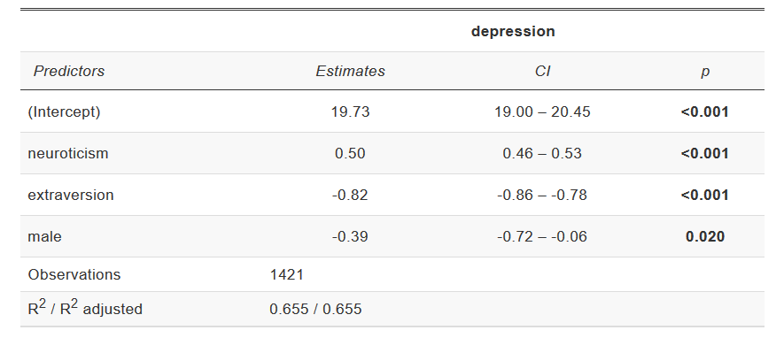

# An Example Analysis

Now that we've covered the fundamentals of R, we can go through
an example analysis start to finish to see everything works in practice.
We'll use an example dataset from the `carData` package, a study
looking at personality and how it relates to people's decision to volunteer
as a research participant.

We'll run through some different steps, working towards some simple analyses
of the data. In this format, the steps will be broken up in different chunks,
but normally they would all be saved in a single script which could
be run in one go. In a script, it can be useful to label each
section with a commented heading - if you end a comment line with at least 4 `#`'s,
RStudio automatically treats it as a heading, and you'll be able to jump
to that section:

```{r comment_header_example}
### Load libraries #####
# Code goes here

### Load data ##########
# More code here
```

First, we'll make sure we have the `carData` and `sjPlot` packages
installed - please copy and run this code in your console (don't
worry if you don't understand it for now):

```{r install_eg_packages, eval=FALSE}
for (req_package in c("car", "carData", "sjPlot", "effects")) {
    if (! require(req_package, character.only = TRUE)) {
      install.packages(req_package)
    }
}
```

## Loading libraries

The first step in any analyses is to load any libraries we're going
to use. If you're part way through an analysis and realise you're going
to use another library, go back and add it to the top of the script.

For now, we're only using the `sjPlot` library, which produces
nice looking plots from regression models.

```{r load_libraries}
library(sjPlot)
```

## Loading data

Normally, this is where you would read your data in from an external
file, using something like `readr::read_csv()` or `haven::read_spss()`.
Instead, we'll just take the existing `carData::Cowles` data and
assign a copy of it to a new variable name.

```{r load_data}
# A short, simple name for you main dataset is nice because you'll
#   probably have to type it out a lot
cow = carData::Cowles
```

This is a reasonably big dataset, with 1421 rows (visible in the "Environment"
pane in RStudio, or you can get it with `nrow(cow)`). If you just print
the data in the console by entering `cow`, you'll get a lot of output
(but luckily not all 1000+ rows). Instead, it's often best to use
`head(data)` to see the first few rows when you just want to look at the 
 basic format of your data:

```{r data_head_example}
head(cow)
```

We can check the format of the data using `str()`, short for
**structure**:

```{r check_data_structure}
str(cow)
```

All the columns have a sensible format here: the two personality
scores are `integer`s (whole numbers), and the two categorical
variables are `factor`s[^factor-warning]. If you need to change
the type of any variables in your data, it's best to do it
right after loading the data, so you can work with consistent
types from that point on.

[^factor-warning]: Some of the most common problems in R result
from text data that should just be in `character` format being
stored as `factor`. `factor` should only be used if you
have categorical variables with a fixed number of levels (usually
a small number). If you have text columns, check how they've
been stored.

## Recoding

Let's go through some basic recoding. First we'll create a variable
to show whether someone is above or below the mean for extraversion.
We'll do this manually first, using the tools we've covered so far:

```{r manual_recode_example, options}
# Create a vector that's all "Low" to start with
cow$high_extraversion = "Low"
# Replace the values where extraversion is high
cow$high_extraversion[cow$extraversion > mean(cow$extraversion)] = "High"
# Make it a factor
cow$high_extraversion = factor(
    cow$high_extraversion,
    levels = c("Low", "High")
)
```

Next we'll code people as either "introverts" or "extroverts" based
on their scores. We'll use a function called `ifelse()` to do this,
which makes the process we carried out above a bit more automatic:

```{r simple_recode_example}
cow$personality_type = ifelse(
    test = cow$extraversion > cow$neuroticism,
    yes = "Extravert",
    no = "Introvert"
)
# Make it a factor
cow$personality_type = factor(
    cow$personality_type,
    levels = c("Introvert", "Extravert")
)
```

`ifelse()` makes it easy to create
a vector based on a test, picking values from the `yes` argument
when the test is `TRUE` and from the `no` argument when the test
is `FALSE`:


We'll also code neuroticism and extraversion
as either "low" or "high" based on whether they're
above the mean:

```{r low_high_recodes}
cow$high_neuroticism = ifelse(
    cow$neuroticism > mean(cow$neuroticism),
    "High",
    "Low"
)
cow$high_neuroticism = factor(
    cow$high_neuroticism,
    levels = c("Low", "High")
)
```

Since the example dataset we're using doesn't have
quite enough variables, let's also create a new one
(not recommended in actual data):

```{r create_var_example}
# Advanced code: run this but don't worry too much about what
#   it's doing
set.seed(1)
cow$depression = round(
  19 + 
  0.5 * cow$neuroticism +
  -0.8 * cow$extraversion +
  0.5 * (cow$sex == "female") +
  rnorm(nrow(cow), sd = 3)
)
```

We'll recode this "depression" score into categories using
`cut()`, which allows us to divide up scores into
more than two categories:

```{r cut_recode_example}
cow$depression_diagnosis = cut(
    cow$depression,
    breaks = c(0, 20, 25, 33),
    labels = c("None", "Mild", "Severe"),
    include.lowest = TRUE
)
```

## Descriptive Statistics

Before doing any actual analysis it's always good to use
descriptive statistics to look at the data and get a sense
of what each variable looks like.

### Quick data summary

You can get a good overview of the entire dataset using
`summary()`:

```{r summary_df_example}
summary(cow)
```

### Frequency tables

You can count frequencies of categorical variables with
`table()`:

```{r freq_table_example}
table(cow$sex)
table(cow$sex, cow$volunteer)
```

### Histograms: distributions of continuous variables

Histograms are good for checking the range of scores
for a continuous variable to see if there are any
issues like skew, outlying scores etc.. Use `hist()`
to plot the histogram for a variable:

```{r hist_example, fig.width=4, fig.height=3}
hist(cow$neuroticism)
```

### Scatterplots: relationship between two continuous variables

Scatterplots are useful for getting a sense of whether or
not there's a relationship between two continuous variables.
The basic `plot()` function in R is quite flexible, so to
produce a scatter plot we just give it the two variables
and use `type = 'p'` to indicate we want to plot points.

```{r scatter_example, fig.width = 5, fig.height = 4}
plot(cow$neuroticism, cow$depression, type='p')
```

This plot doesn't look great - we'll cover ways to produce
better plots later. But you can see there's a positive
correlation between neuroticism and depression.[^fakedata]
To check the correlation we can use `cor()`:

```{r correlation_example}
cor(cow$neuroticism, cow$depression)
```

[^fakedata]: Keen readers will notice that the positive correlation is
there because we put it there when generating the fake depression
variable.

## Analysis

### T-test

We can conduct a simple *t* test of the differences in depression
scores between males and females using the `t.test()` function.
We can get the vector of scores for males and females by subsetting
and passing them to the function:

```{r t_test_vectors_example}
dep_sex_test = t.test(cow$depression[cow$sex == "male"],
                      cow$depression[cow$sex == "female"])
dep_sex_test
```

Since we've saved the model object (basically a `list`) to a variable, we can 
access the values we're most interested in if we need to use them again:

```{r t_test_values}
dep_sex_test$p.value
```

To discover what values are available, you can look at the **Value**
section of the `?t.test` help page, or just type `dep_sex_test$` and
let RStudio bring up the list of suggestions.

### Formulas: a simple mini-language for expressing models

If we look at `?t.test`, we can see that there are actually
two different options for running a test: either pass two separate 
vectors of scores representing the groups we want to compare,
or use a **formula**.

Formulas in R allow you to spell out models using a compact syntax,
allowing you to focus on the overall structure of your model. Formulas
in R contain `~` (a "tilde"), with the outcome on the left of the `~` and
the predictors in the model on the right. For our t-test we have
`depression` as the outcome and `sex` as the grouping variable (our only
"predictor"). Running a *t* test with a formula looks like:

```{r t_test_formula_example}
t.test(depression ~ sex, data = cow)
```

When we're using a formula, we can usually use a `data =` argument
to say where all the variables in the model come from. R will automatically
look them up in the dataframe, without us having to access them manually.

### Regression

We can also run a simple linear regression, prediction `depression`
(our outcome) using `neuroticism`, `extraversion` and `sex`. In R,
linear regression can be done using `lm()` (short for **l**inear
**m**odel). Our model looks like:

```{r r_regress_example}
dep_reg = lm(depression ~ neuroticism + extraversion + sex,
             data = cow)
summary(dep_reg)
```

#### Why was that so easy?

The regression model above was simple to fit because:

* We had all our data in a nice clean dataframe (in **long** format)
* All our continuous variables were coded as numeric
* All our categorical variables (`sex`) were coded as factors

Most of the setup for running models in R happens beforehand. Factors
will be treated as discrete variables, and numeric variables as
continuous variables, so make sure all your variables are the
right type before you try to fit a model.

If you don't have variables coded the right way, go back up
to the "recoding" section of your script and fix them there.

#### Formula syntax

The syntax you use in formulas is special, and it doesn't
necessarily mean the same thing as it would in regular R. For example
`+` doesn't mean "add these values together", it just means "also
include this predictor". The most important symbols in formula syntax
are:

* `+`: just used to separate each individual predictor
* `time:group`: `:` creates an interaction term between two variables,
  and only that interaction term.
* `time*group`: `*` creates an interaction term between two variables,
  and also includes the individual main effects (`time` and `group` in
  this example). Usually more useful than `:` because interactions
  generally don't make sense without the main effects.
* `1`: when you use `1` as a predictor on its own, it means "include
  an intercept in the model". This is the default so you don't
  have to include it. Intercepts make sense in most models.
* `0`: signals that you don't want to fit an intercept. Not recommended
  most of the time.

#### Working with a fitted model

Once we've saved a fitted model to a variable, we can use it,
check it and save it in lots of different ways. The most
useful way is to call `summary(model)` like we did above,
which produces a summary table for the coefficients along
with a few useful statistics like $R^2$.

There are also hundreds of different functions that people
have written to work with models and provide useful output,
both built in to R and available in packages. When possible,
look for a function that's already been written - there's no need
to reinvent the wheel. But if you want something that's not covered,
all the data you need is available, and you can use it to produce
exactly what you need.

`plot(model)` 
(a built in command)
produces a few standard diagnostic plots that do things
like check the normality of your residuals and whether
particular outliers are affecting the fit:

```{r plot_lm_example}
# This temporarily switches R's plotting to a 2x2 layout
par(mfrow = c(2, 2))
plot(dep_reg)
# Switch plots back to normal
par(mfrow = c(1, 1))
```

```{block, type='note'}
If you wanted to create the first plot from scratch,
you could plot `fitted(dep_reg)` against `resid(dep_reg)`.
```

`plot_model` from the `sjPlot` package can give
us a nice visualisation of the effects in our model, automatically
choosing the right kind of plot for the predictor depending on
whether it's continuous or categorical:

```{r plot_model_example}
plot_model(dep_reg, 
           # We want to see the effect of each predictor,
           #   but lots of other plot types are available
           type = "eff",
           terms = "neuroticism")

plot_model(dep_reg, 
           type = "eff",
           terms = "sex")
```

You're also not stuck with the default presentation
of results from `summary()`, as there are lots of ways
to turn your model into a nice-looking table for publication.
`tab_model()`, also from the `sjPlot` package, produces
good tables for regression models:

```{r tab_model_example,eval=FALSE}
tab_model(dep_reg)
```



## Pointless flashy nonsense:

Impress your friends and supervisors!

**NOTE:** Don't try to run this code (for now), it requires some
libraries that are tricky to install.

```{r flashy_example, eval=FALSE}
library(rgl)
library(rayshader)

hex_gg = ggplot(cow, aes(x =  neuroticism, y = extraversion)) +
    stat_bin_hex(aes(fill = stat(density), colour = stat(density)), 
                 bins = 10,
                 size = 1) +
    scale_fill_viridis_c(option = "B") +
    scale_color_viridis_c(option = "B", guide = "none") +
    labs(x = "Neuroticism", y = "Extraversion", fill = "",
         colour = "") +
    theme_minimal()
hex_gg

plot_gg(hex_gg, multicore = TRUE, windowsize = c(800, 800))
render_movie("silly.mp4", phi = 40, theta = 30)
```

<video autoplay loop muted playsinline>
  <source src="Images/silly.webm" type="video/webm">
</video>
