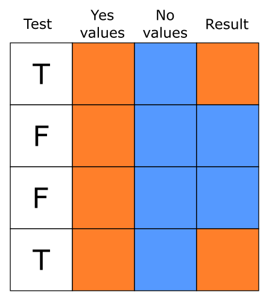

# An Example Analysis

Now that we've covered the fundamentals of R, we can go through
an example analysis start to finish to see everything works in practice.
We'll use an example dataset from the `carData` package, a study
looking at personality and how it relates to people's decision to volunteer
as a research participant.

We'll run through some different steps, working towards some simple analyses
of the data. In this format, the steps will be broken up in different chunks,
but normally they would all be saved in a single script which could
be run in one go. In a script, it can be useful to label each
section with a commented heading - if you end a comment line with at least 4 `#`'s,
RStudio automatically treats it as a heading, and you'll be able to jump
to that section:

```{r comment_header_example}
### Load libraries #####
# Code goes here

### Load data ##########
# More code here
```

First, we'll make sure we have the `carData` package installed - please
copy and run this code in your console:

```{r install_cardata, eval=FALSE}
if (! require("carData", character.only = TRUE)) {
  install.packages(c("car", "carData"))
}
```

## Loading libraries

The first step in any analyses is to load any libraries we're going
to use. If you're part way through an analysis and realise you're going
to use another library, go back and add it to the top of the script.

For now, we're only using the `ggplot2` library, which produces
nice looking plots.

```{r load_libraries}
library(ggplot2)
```

## Loading data

Normally, this is where you would read your data in from an external
file, using something like `readr::read_csv()` or `haven::read_spss()`.
Instead, we'll just take the existing `carData::Cowles` data and
assign a copy of it to a new variable name.

```{r load_data}
# A short, simple name for you main dataset is nice because you'll
#   probably have to type it out a lot
cow = carData::Cowles
```

This is a reasonably big dataset, with 1421 rows (visible in the "Environment"
pane in RStudio, or you can get it with `nrow(cow)`). If you just print
the data in the console by entering `cow`, you'll get a lot of output
(but luckily not all 1000+ rows). Instead, it's often best to use
`head(data)` to see the first few rows when you just want to look at the 
 basic format of your data:

```{r data_head_example}
head(cow)
```

We can check the format of the data using `str()`, short for
**structure**:

```{r check_data_structure}
str(cow)
```

All the columns have a sensible format here: the two personality
scores are `integer`s (whole numbers), and the two categorical
variables are `factor`s[^factor-warning]. If you need to change
the type of any variables in your data, it's best to do it
right after loading the data, so you can work with consistent
types from that point on.

[^factor-warning]: Some of the most common problems in R result
from text data that should just be in `character` format being
stored as `factor`. `factor` should only be used if you
have categorical variables with a fixed number of levels (usually
a small number). If you have text columns, check how they've
been stored.

## Recoding

Let's go through some basic recoding. First we'll code
people as either "introverts" or "extroverts" based
on their scores:

```{r simple_recode_example}
cow$personality_type = ifelse(
    test = cow$extraversion > cow$neuroticism,
    yes = "Extravert",
    no = "Introvert"
)
# Make it a factor
cow$personality_type = factor(
    cow$personality_type,
    levels = c("Introvert", "Extravert")
)
```

We've used the `ifelse()` function, which makes it easy to create
a vector based on a test, picking values from the `yes` argument
when the test is `TRUE` and from the `no` argument when the test
is `FALSE`:



We'll also code neuroticism and extraversion
as either "low" or "high" based on whether they're
above the mean:

```{r low_high_recodes}
cow$high_neuroticism = ifelse(
    cow$neuroticism > mean(cow$neuroticism),
    "High",
    "Low"
)
cow$high_neuroticism = factor(
    cow$high_neuroticism,
    levels = c("Low", "High")
)
```