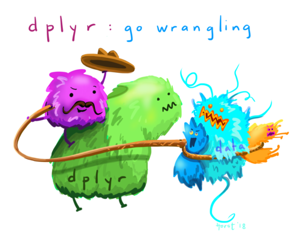

# Easier analysis with the tidyverse

Now that you know the basics of R, it's time to learn that there
are much better ways to do everything you just learnt!

## Introduction to the tidyverse

The [tidyverse](https://www.tidyverse.org/) is a bundle of packages that 
make using R easier because they're all designed to work together. Most 
"tidy" functions work well together because they:

* Take a dataframe as their input
* Return as dataframe as their output

They also do a small amount of "magic", allowing you to just type
column names like `group` and `time` rather than having to
spell out the name of the dataframe each time (like `survey1$group`, 
`survey1$time`).

You might not use every package from the `tidyverse` in an analysis,
but you can still load them all at the start of most analyses, and
know you'll have a standard set of tools available. To load
them all, just use:

```{r load_tidyverse, options}
library(tidyverse)
```

For this session, we'll use the `cowles` data again, so let's
load it up:

```{r load_cowles_again, options}
cow = carData::Cowles
```

## `dplyr`: Turning complex analyses into simple steps



As your analyses get more complicated, your code can get
more complicated as well. To get to the answers you want,
you might have to:

* Drop certain rows from your dataset because they're invalid
  or not relevant.
* Calculate stats for each treatment group separately.
* Use summary variables like the school mean to calculate
  a standardized score.
 
and more importantly, you might have to combine multiple
different operations like these for each calculation you're
doing.
  
The `dplyr` package in the tidyverse makes this easier
by providing a small number of simple "verbs" that can be combined
easily to perform complex tasks. Each one takes your current
data, changes it, and returns it. The most common verbs you'll
use are:

* `filter()`: choose rows to keep based on a logical test,
  dropping the rest.
* `arrange()`: sort the data.
* `select()`: choose columns to keep.
* `mutate()`: add new columns.
* `summarize()`: create columns that summarise the data down
  to a single row.
* `count()`: Count the number of rows in the data.

And, possibly most importantly:

* `group_by()`: Split the data into groups, so that any
  subsequent steps happen separately for each group. 
  
We'll go over examples of all of these below.
  
### Pipes: `%>%`

`dplyr` and the `tidyverse` make heavy use of **pipes** to
make it easier to carry out multiple processing steps in a row.
A pipe looks like:

```
%>%
```

If you have a calculation that takes multiple steps, it gets
confusing if you run them all in one go. Here we'll calculate
the mean of extraversion for the males in the data:

```{r multiple_calls_example, options}
summarise(filter(cow, sex == "male"), male_mean = mean(extraversion))
```

The first step here is actually `filter`ing the data, but
we have to write these function calls "inside out". R understands
it fine but most human beings struggle to understand the logic
of what's happening, especially if there's more than 2 of
these "nested" steps happening.

You can do the steps one by one instead, but it's clunky, and you
may have to create multiple intermediate variables:

```{r multiple_steps_example, eval=FALSE}
males = filter(cow, sex == "male")
summarise(males, male_mean = mean(extraversion))
```

Using pipes, you can do each step, and then send it **through
the pipe** to the next step. To get the mean extraversion
for males using pipes, we can do:

```{r pipes_example, options}
cow %>%
    filter(sex == "male") %>%
    summarise(male_mean = mean(extraversion))
```

See how we're not actually specifying a dataframe for the
`filter()` and `summarise()` functions? That's because
the `%>%` pipe **automatically sends the data as
the first argument to the next function**. 

### Common tasks with `dplyr`

#### Selecting rows with filter

Choosing rows with a logical test with `filter()` works just like
subsetting your data with a logical vector, it's just easier
to do it as part of a sequence of steps:

```{r dplyr_filter_example, options}
cow %>%
  filter((sex == "male") & (volunteer == "yes")) %>%
  head()
```

#### Sorting with `arrange`

With `arrange`, you can sort by one or more columns. Use `desc(column)`
(short for **descending**) to sort that column in the opposite direction:

```{r dplyr_arrange_example, options}
cow %>%
  arrange(sex, volunteer, desc(extraversion)) %>%
  head()
```

#### `group_by` for calculations within groups.

`group_by()` is very useful for calculating different stats in
subgroups of your data. This covers a *lot* of the more complex
operations you might need to do with your data, so it unlocks
a lot of possibilities.

You can do things like: mean-centering scores separately for
males and females:

```{r center_in_groups, options}
cow %>%
    group_by(sex) %>%
    mutate(
        extraversion_centered = extraversion - mean(extraversion)
    )
```

Calculating means and SDs for subgroups:

```{r summarise_in_groups, options}
cow %>%
    group_by(sex, volunteer) %>%
    summarise(mean = mean(neuroticism),
              sd = sd(neuroticism))
```

#### Frequency tables with `count`

`count()` gives you a straightforward way to create a frequency table. There's
no builtin way to calculate percentages, but you can easily add them
using `mutate()`:

```{r count_percent_example, options}
cow %>%
    count(sex) %>%
    # count creates a column called 'n'
    mutate(percent = n / sum(n) * 100)
```

If you have multiple levels of grouping, you need to think about
how you want to calculate percentages. To get the percentage
who volunteered within each sex:

```{r count_complex_percent, options}
cow %>%
    count(sex, volunteer) %>%
    group_by(sex) %>%
    mutate(percent = n / sum(n) * 100)
```