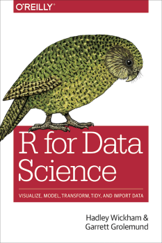

# Learning more/Getting help {-}

## More courses/books {-}

If you want more material than is covered in this course,
there are lots of different introductions to R out there,
many of them free.

My number one recommendation is the book [R for Data Science](https://r4ds.had.co.nz/),
written by Garrett Grolemund and Hadley Wickham (who we met at the start of
the course). It's a comprehensive and accessible intro that covers visualization,
data wrangling and analysis, all using modern R tools to make things as easy as possible.

Other good resources include:

* [swirl](https://swirlstats.com/), an interactive tutorial for R.
* The [R Graph Gallery](https://www.r-graph-gallery.com/): lots of cool examples of
  different plots.
* The [R Graphics Cookbook](https://r-graphics.org/), which has a huge number
  of examples of useful plots, mostly in `ggplot2`.
* Any of the other books listed on [bookdown.org](https://bookdown.org/).
* The R courses on [DataCamp](https://www.datacamp.com/), which have a cool
  interactive system that tests you as you go. Most are paid but there are free trials
  to test it out.
  
## Checking out the R community {-}

* If you're on Twitter, check out the [#rstats](https://twitter.com/hashtag/rstats)
  hashtag.
* Check out [R Bloggers](https://www.r-bloggers.com/), which collects blog posts
  from a huge number of different R blogs. 

## Getting help {-}

If you're stuck with your R code, the best option is to **ask someone you know
who knows R** - some problems can be solved very quickly with a nudge in
the right direction from someone who's experienced them before.

[Stack Overflow](https://stackoverflow.com/) is a resource used by programmers
the world over. Lots of experienced programmers are happy to answer questions
on there to keep their skills sharp and earn useless points 
(I have [a lot of these useless points](https://stackoverflow.com/users/1222578/marius)).
The trick to asking a question on Stack Overflow is:

* Do a few google searches for your question before heading to Stack Overflow. The
  answer you need might pop up (and will often already be on Stack Overflow).
* Carefully read the guide to creating a 
  [reproducible example](https://stackoverflow.com/questions/5963269/how-to-make-a-great-r-reproducible-example)
  for your question.
* Try to write a question that includes both the code you're already tried, and a
  copy-pasteable version of your dataset.
  
Stack Overflow works best for small, self-contained coding questions, with an objective
answer. If you have a broader question that involves a bit more opinion,
you may want to try on the [RStudio Community forum](https://community.rstudio.com/).