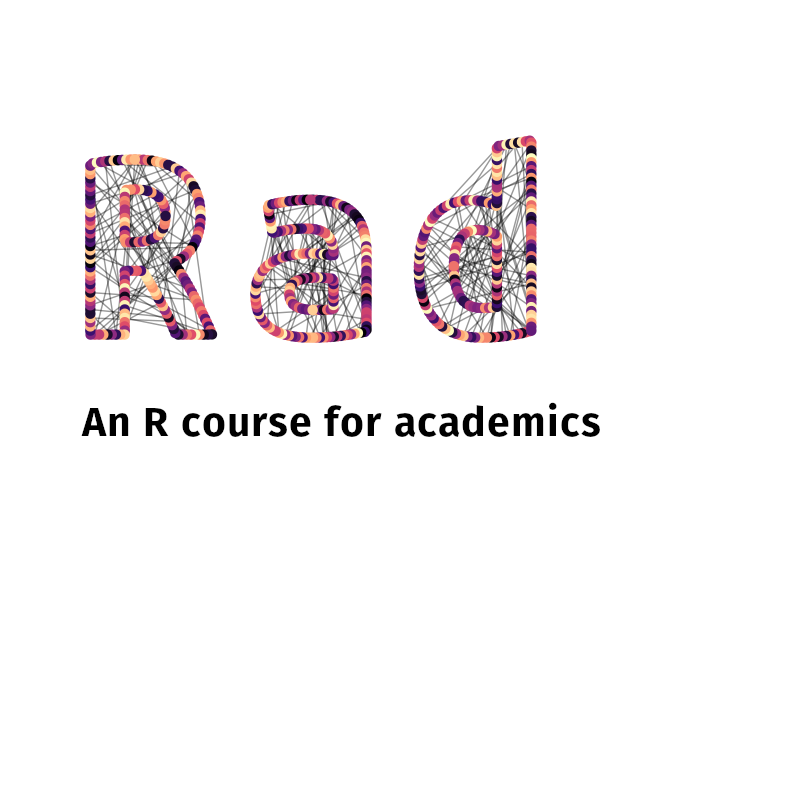

--- 
title: "Matilda Intro to R Workshop"
author: "Marius Mather (with tweaks by Rachel Visontay"
date: "`r Sys.Date()`"
site: bookdown::bookdown_site
documentclass: book
bibliography: [book.bib, packages.bib]
biblio-style: plain
link-citations: yes
nocite: | 
  @R-base, @R-bookdown, @R-knitr, @R-rmarkdown, @R-sjPlot, @R-car, @R-ggplot2
colorlinks: yes
monofontoptions: "Scale=0.7"
description: "An accessible introduction to R that doesn't assume programming experience"
url: "https://bookdown.org/marius_mather/Rad/"
cover-image: "Images/Cover.png"
favicon: "Images/rad_logo_r.png"
---

```{r setup, include=FALSE}
req_packages = c('car', 'carData', 'sjPlot', 'effects', 
                 'readxl', 'tidyr', 'svglite',
                 'lme4')

lapply(req_packages, function(pkg) {
  if (system.file(package = pkg) == '') install.packages(pkg)
})
```


# Welcome {-}

.png "Green Modern Matrix Code Coming Soon Instagram Story (2)")

This course has been adapted from ex-Matilda Marius Mather's R for Academics course. 

This session is designed to get people started with a programming approach to data management and analysis. We’ll be using R, but a lot of the concepts in R will transfer to other software.



