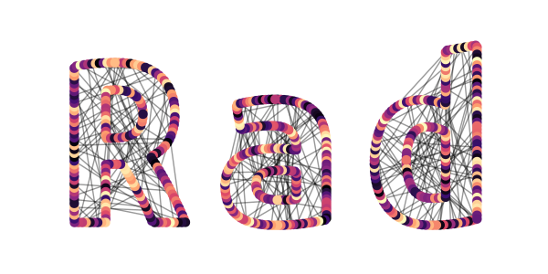

--- 
title: "Rad: R for academics"
author: "Marius Mather"
date: "`r Sys.Date()`"
site: bookdown::bookdown_site
documentclass: book
bibliography: [book.bib, packages.bib]
biblio-style: plain
link-citations: yes
description: "An introduction to using R for data management and analysis"
---

# Introduction {-}

This is an experiment in running some short, informal training
sessions to get people started with a programming approach to data
management and analysis. We'll be using R, but a lot of the concepts
in R will transfer to other software.

There may also be some room to include some info about basic web design or
other related topics - some of this can be done through R, and more
info can be provided if needed.

Training will be pitched at the beginner level - you don't
need to know the difference between a CSS and a CSV file
to get started.

I'll run short lunchtime sessions, working through
each topic at a relaxed pace with plenty of time
for questions.

What to bring:

* Your fancy new laptop: these will be practical, 
  hands-on sessions.
* Your lunch: don't skip food in favour of programming.

Please join us for the first session: [Getting Started With R](#installing)

## Can't attend? {-}

Material that I put together for these sessions will be
added to this blog, which will hopefully grow into
a useful resource as the sessions continue.
